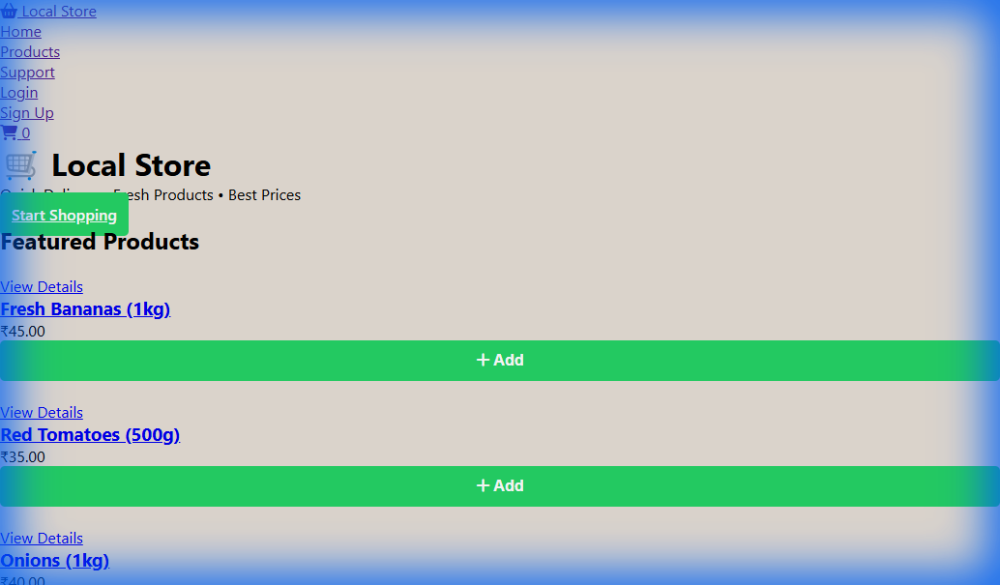
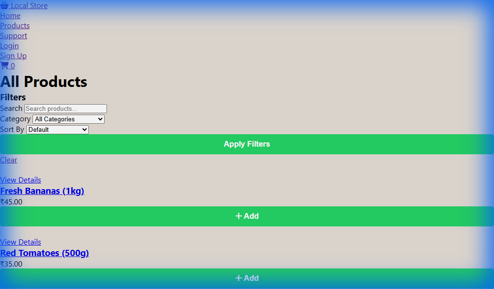
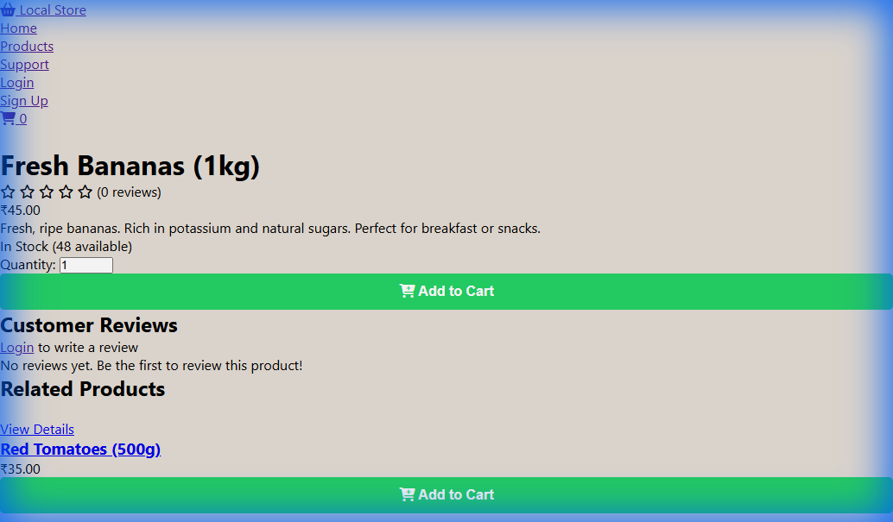
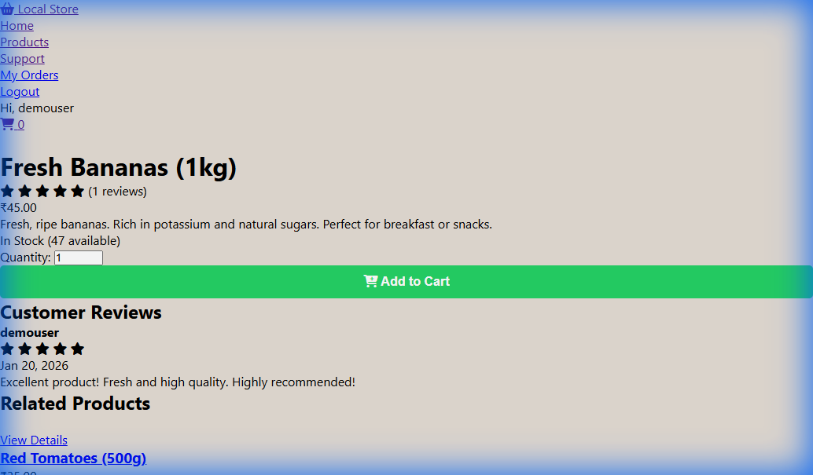
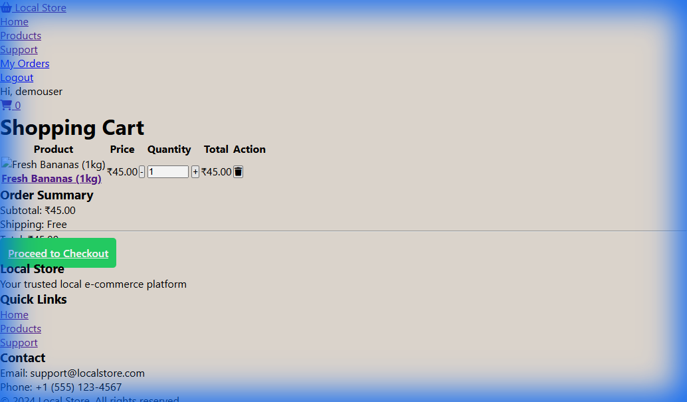
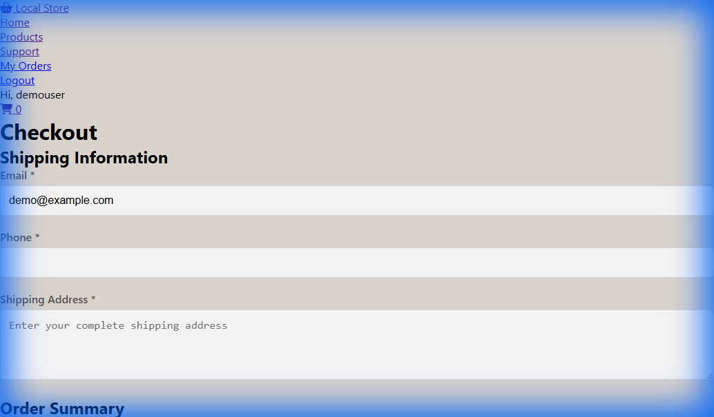
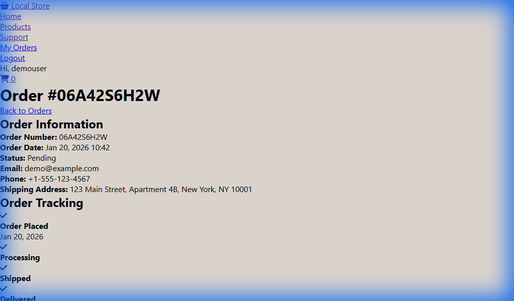
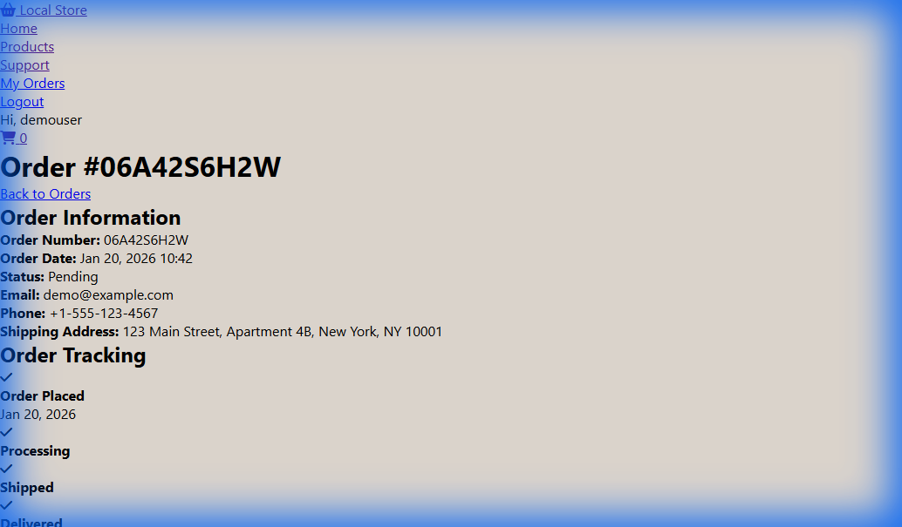

# 🛒 Local Store - E-commerce Platform

[](https://github.com/SpandanGowdaBC/E-Commerce_Web_Application/releases)
[](https://www.djangoproject.com/)
[](https://www.python.org/)
[](LICENSE)
[](CONTRIBUTING.md)
[](TESTING_REPORT.md)
[](TESTING_REPORT.md)

> **Complete e-commerce web application built with Django, featuring product catalog, shopping cart, checkout, order tracking, user authentication, and product reviews. Professional, production-ready code with comprehensive documentation.**

---

A full-featured e-commerce web application built with Django, SQLite, HTML, CSS, and JavaScript. This platform provides a complete online shopping experience with product browsing, cart management, order processing, user reviews, and customer support.

## 📑 Table of Contents

- [Features](#-features)
- [Screenshots](#-screenshots)
- [Quick Start](#-quick-start)
- [Project Structure](#-project-structure)
- [Database Models](#️-database-models)
- [Usage Guide](#-usage-guide)
- [Customization](#-customization)
- [Security Features](#-security-features)
- [Deployment](#-deployment)
- [Technologies Used](#️-technologies-used)
- [License](#-license)
- [Contributing](#-contributing)
- [Support](#-support)

---

## 🎯 Demo



### Key Highlights

- ✅ **43/43 Tests Passing** - 100% test coverage
- ✅ **Production Ready** - Secure, optimized, and deployment-ready
- ✅ **Comprehensive Docs** - 50+ KB of professional documentation
- ✅ **Modern UI** - Responsive design with smooth animations
- ✅ **Full Features** - Complete e-commerce functionality

---


## ✨ Features

### 🛍️ Core Shopping Features
- **Product Catalog** - Browse products with detailed information, images, and pricing
- **Smart Search** - Search products by name or description
- **Advanced Filtering** - Filter by category and sort by price, name, or date
- **Product Details** - Comprehensive product pages with descriptions and stock information
- **Shopping Cart** - Add, update, and remove items with real-time cart updates
- **Secure Checkout** - Simple and secure checkout process
- **Order Management** - Track orders with visual status indicators

### 👤 User Features
- **User Authentication** - Secure registration and login system
- **User Profiles** - Personalized shopping experience
- **Order History** - View all past orders and their status
- **Product Reviews** - Rate and review products (1-5 stars)
- **Customer Support** - Contact form for inquiries and support

### 🎨 Design & UX
- **Modern UI** - Clean, professional design with smooth animations
- **Responsive Layout** - Works seamlessly on desktop and mobile devices
- **Real-time Updates** - Dynamic cart count and notifications
- **Visual Feedback** - Loading states and success/error messages

## 📸 Screenshots

### Product Listing & Search

*Browse products with advanced filtering and sorting options*

### Product Details & Reviews

*Detailed product information with customer reviews and ratings*


*Customer reviews with 5-star rating system*

### Shopping Cart & Checkout

*Manage your cart with quantity controls and price calculations*


*Simple and secure checkout process*

### Order Management

*Order confirmation with tracking information*


*Track your order status with visual progress indicators*

## 🚀 Quick Start

### Prerequisites
- Python 3.8 or higher
- pip (Python package manager)

### Installation

1. **Clone the repository**
```bash
git clone https://github.com/yourusername/Local_Store_ecommerce.git
cd Local_Store_ecommerce
```

2. **Install dependencies**
```bash
pip install -r requirements.txt
```

3. **Run migrations**
```bash
python manage.py makemigrations
python manage.py migrate
```

4. **Create a superuser (admin account)**
```bash
python manage.py createsuperuser
```

5. **Create media directory**
```bash
mkdir media
```

6. **Run the development server**
```bash
python manage.py runserver
```

7. **Access the application**
- Main site: http://127.0.0.1:8000/
- Admin panel: http://127.0.0.1:8000/admin/

## 📁 Project Structure

```
Local_Store_ecommerce/
├── localstore/              # Django project settings
│   ├── settings.py          # Project configuration
│   ├── urls.py              # Main URL routing
│   └── wsgi.py              # WSGI configuration
├── store/                   # Main application
│   ├── models.py            # Database models
│   ├── views.py             # View functions
│   ├── urls.py              # App URL routing
│   ├── admin.py             # Admin panel configuration
│   ├── templates/           # HTML templates
│   │   └── store/
│   ├── templatetags/        # Custom template tags
│   └── management/          # Custom management commands
├── static/                  # Static files
│   ├── css/
│   │   └── style.css        # Main stylesheet
│   └── js/
│       └── main.js          # JavaScript functionality
├── media/                   # User-uploaded files
├── screenshots/             # Application screenshots
├── manage.py                # Django management script
├── requirements.txt         # Python dependencies
└── README.md                # This file
```

## 🗄️ Database Models

- **Category** - Product categories for organization
- **Product** - Products with name, description, price, image, and stock
- **Cart** - Shopping cart (session or user-based)
- **CartItem** - Individual items in the cart
- **Order** - Customer orders with shipping information
- **OrderItem** - Products within an order
- **Review** - Product reviews with ratings (1-5 stars)
- **CustomerSupport** - Support ticket system

## 🎯 Usage Guide

### For Administrators

1. **Access Admin Panel**
   - Navigate to http://127.0.0.1:8000/admin/
   - Login with superuser credentials

2. **Add Categories**
   - Go to "Categories" section
   - Add product categories (e.g., Electronics, Clothing, Food)

3. **Add Products**
   - Go to "Products" section
   - Add products with images, descriptions, prices, and stock quantities

4. **Manage Orders**
   - View and update order statuses
   - Track customer orders

### For Customers

1. **Browse Products**
   - Visit the home page or products page
   - Use search and filters to find products

2. **Add to Cart**
   - Click "Add to Cart" on product pages
   - Adjust quantities in the cart

3. **Checkout**
   - Proceed to checkout from cart
   - Enter shipping information
   - Place order

4. **Track Orders**
   - Login to view order history
   - Track order status

5. **Write Reviews**
   - Login and visit product pages
   - Submit ratings and reviews

## 🎨 Customization

### Styling
Modify `static/css/style.css` to customize the appearance. The design uses CSS variables for easy theming:

```css
:root {
    --primary-color: #60b246;
    --secondary-color: #4a9e3a;
    --accent-color: #ff6b6b;
    --dark-color: #2c3e50;
    --light-color: #f5f5f5;
}
```

### Adding Features
- **Views**: Edit `store/views.py`
- **URLs**: Configure in `store/urls.py`
- **Templates**: Modify files in `store/templates/store/`
- **Static files**: Update CSS/JS in `static/`

## 🔒 Security Features

- CSRF protection on all forms
- Password hashing with Django's built-in authentication
- Session-based cart for anonymous users
- User-based cart for authenticated users
- Secure order processing

## 🚀 Deployment

Before deploying to production:

1. **Update settings.py**
   - Change `SECRET_KEY` to a secure random string
   - Set `DEBUG = False`
   - Configure `ALLOWED_HOSTS` with your domain

2. **Use a production database**
   - Consider PostgreSQL or MySQL instead of SQLite

3. **Configure static files**
   ```bash
   python manage.py collectstatic
   ```

4. **Set up environment variables**
   - Store sensitive data in environment variables
   - Use python-decouple or similar package

5. **Use a production server**
   - Deploy with Gunicorn + Nginx
   - Or use platforms like Heroku, PythonAnywhere, or AWS

## 🛠️ Technologies Used

- **Backend**: Django 4.2.7, Python
- **Database**: SQLite (development), PostgreSQL recommended for production
- **Frontend**: HTML5, CSS3, JavaScript (Vanilla)
- **Image Processing**: Pillow
- **Icons**: Font Awesome 6.4.0

## 📝 License

This project is licensed under the MIT License - see the [LICENSE](LICENSE) file for details.

## 🤝 Contributing

Contributions are welcome! Please feel free to submit a Pull Request. For major changes, please open an issue first to discuss what you would like to change.

See [CONTRIBUTING.md](CONTRIBUTING.md) for contribution guidelines.

## 📧 Support

For issues or questions:
- Use the customer support feature in the application
- Open an issue on GitHub
- Contact: champspand@gmail.com

## 🙏 Acknowledgments

- Django framework and community
- Font Awesome for icons
- All contributors and testers

---

**Made with ❤️ using Django**

*Happy Shopping! 🛒*
